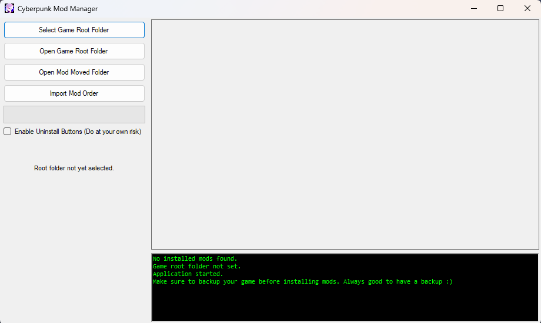
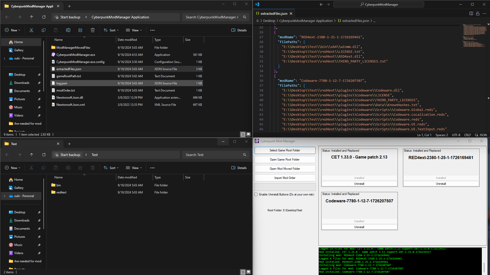

# Cyberpunk 2077 Mod Manager

A simple mod manager made for personal use to manage Cyberpunk 2077 mods efficiently.

## Mod Manager

## After Install Some Mods

## Features

- **Root Install Mods**: Install mods directly into your Cyberpunk 2077 root folder.
  - Example: `C:\Program Files (x86)\Steam\steamapps\common\Cyberpunk 2077`
  
- **Remembers Mod Order**: Tracks the installation order of mods, ensuring correct functionality for sharing or reinstallation.
  
- **Share Mod Order**: Easily export and share your mod installation order with others.

- **Import Mod Order**: Import mod installation orders from others for easy setup.

- **Remembers Installed Mods**: Tracks mods installed through the manager.

- **Uninstall Mods**: Safely uninstall mods while keeping a log of removed files and moves fils to backup folder while keeping a `ModInstalledData.txt` for each mod .

- **Logs**: Logs all Installed files to `Log.json`, Extracted Location to the `extractedFile.json`.

- **Drag and Drop Support**: Drag and drop mods into the application for simple installation.

## Download & How It Works

Download the Cyberpunk2077 Mod Manager [here](https://drive.google.com/drive/folders/1Dkg-b74nzwPhBlVNKKUN9NCdZIEuocwb?usp=sharing).

### Important Information

- **Only works with root extractable mods**: This application manages mods extractable directly to the game's root folder.
  - Example: `C:\Program Files (x86)\Steam\steamapps\common\Cyberpunk 2077`
  
- **Does not detect pre-installed mods**: The manager only tracks mods installed through this tool. Pre-installed mods won't be recognized for uninstallation.

- **Always make backups**: Back up your game files before using the mod manager to prevent unintended issues.

## Installation Steps

1. **Install WinRAR and 7-Zip**: Ensure both are installed. If not, download them before proceeding.
2. **Download the Mod Manager**: Get the application from the link above.
3. **Extract the Files**: Extract the contents to your preferred location (e.g., `E:\Desktop\CyberpunkModManager`).
4. **Open the Application**: Run `CyberpunkModManager.exe` If windows defender promt you with massage go to more info and click Run Anyway.
5. **Set the Game Root Folder**: Select your Cyberpunk 2077 root folder (e.g., `C:\Program Files (x86)\Steam\steamapps\common\Cyberpunk 2077`) Selected root folder will be shown in the mod manager.
6. **Drag and Drop Mods**: Drag and drop your mods into the application.
7. **Install Mods**: Press `Install`. Ensure mods are installed in the correct order.
8. **Verify File Movement**: Use the `Open Mod Moved Folder` button to verify if mod files have been moved correctly.
9. **Check Root Folder**: Confirm the root folder using `Open Game Root Folder`.

## Sharing Mods with Friends

1. Navigate to the `ModManagerMovedFiles` folder in the `CyberpunkModManager` directory.
2. Share both the mods and the `modORder.txt` file with your friend.
   - Ensure there are no duplicate mod names in the file.
3. To install shared mods, your friend should:
   1. Open `CyberpunkModManager.exe`.
   2. Set the game root folder.
   3. Drag and drop the shared mods into the application.
   4. Click `Import Mod Order` and select the shared `modORder.txt`.
   5. Done!

If any mods fail to install, check `failedmodorder.txt` in the application folder for details.

## Uninstalling Mods

**Warning: Uninstalling Mods May Break Your Game**

Uninstalling mods using this tool is designed to keep a log of installed files and Remove them according to extraction. However, it may not always perfectly remove every related file and could potentially disrupt your game. If you’re experienced and know what you're doing, you can review the `log.json` and `extractedFile.json` files and manually edit them if needed. 

**Recommended Approach:**

- **Consult Mod Developers:** Many mod developers provide specific instructions for uninstalling their mods. Use these instructions as your guide to safely uninstall or remove mods.

**Steps to Uninstall a Mod:**

1. Open `CyberpunkModManager.exe` and check enable uninstall button and click `Uninstall` for the mod you want to remove.
2. To reinstall a mod, go to the `ModManagerMovedFiles` folder,drag and drop the mod again, and click `Install`.
3. If the game break you can always check for mod you unininstall from the backup folder and use `ModInstalledData.txt` to move them back to the root.

## Why I Made This

I built this mod manager because every time a game update drops, mods tend to break, and I used to manually remove each mod. While there are probably better alternatives out there, I wanted to create my own solution—and why not give it a try?

## Known Issues

- After reopening the application, installed mods may show a "moving error." Don’t worry, it still works.
- If a mod has a duplicate name in the mod order, it may show as "not installed," but the mod installs correctly.
- After completing a mod order installation, mods may still appear as installed. Restarting the mod manager should fix this.

## License

This project is for personal use and is distributed "as-is". Make sure to back up your files before using.
